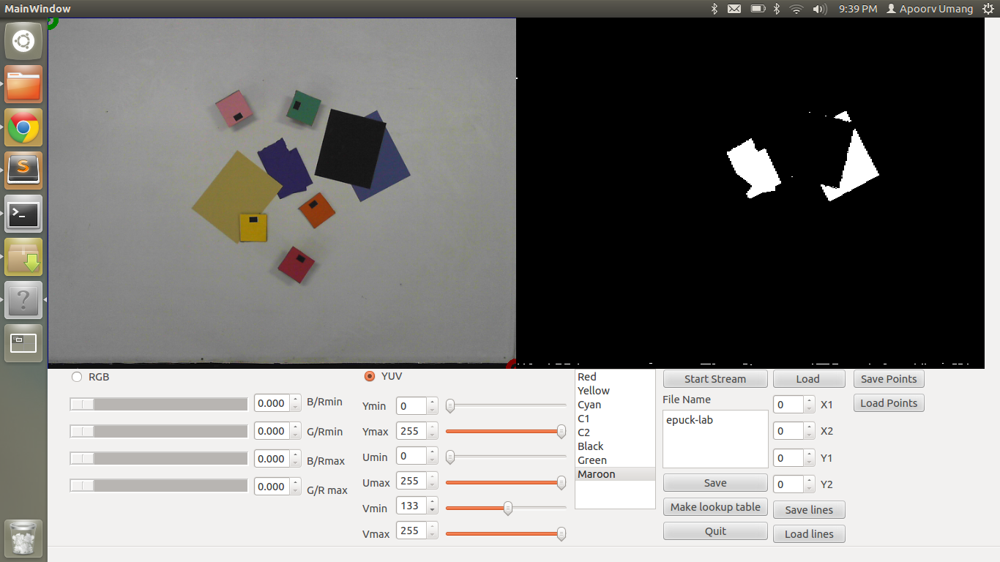
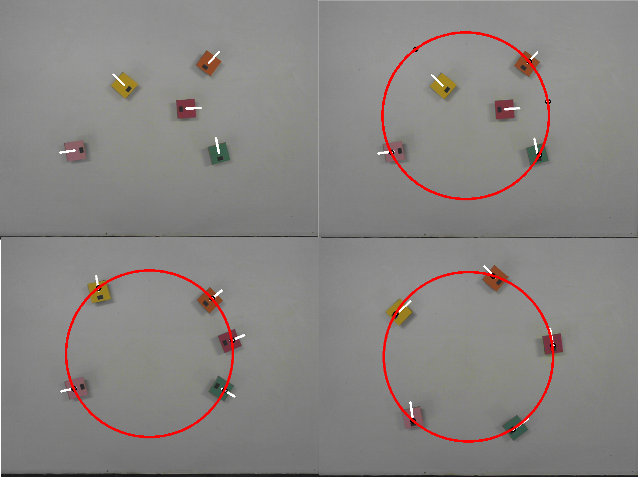

epuck-main
==========

Calibration GUI + Main program for testing swarm algorithms on e-puck robots

Calibration GUI
---------------
Features:
 - Threshold rectangular regions in YUV/RGB colour space
 - Make lookup tables for upto 8 colours
 - Save/load thresholds

Main Program
---------------

Currently runs 2 solutions to the Circle Formation Problem - 1 probabilistic and 1 using a solution to the dining philosopher's problem. 

Reference to algorithms:

 - Probabilistic: (http://ddsg.jaist.ac.jp/pub/SDK04b.pdf)
 - Dining Philosopher's: (http://www.researchgate.net/publication/258884849_A_Distributed_Algorithm_for_Circle_Formation_by_Multiple_Mobile_Robots)

